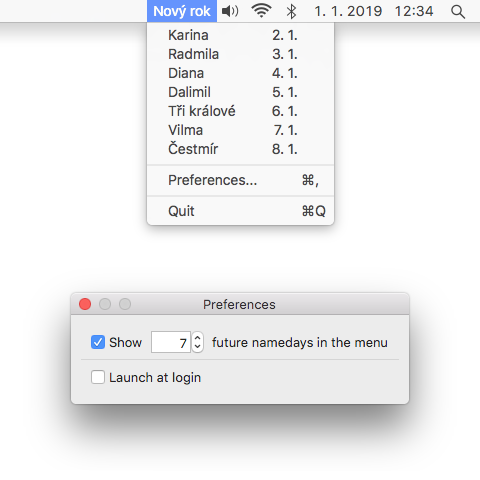

<h1 align="center">Namedays</h1>
 

A Mac app which displays Czech namedays in the menubar.

 

About
-----
*Namedays* is a small utility which shows the current and future Czech namedays in the menubar of your Mac.

This is a small summer project which I did to get some practice with developing Mac apps. There are a few similar projects available, but they are either abandoned or paid, so I wanted to make a free, simple, open source alternative to replace them.

Installation
------------
*Namedays* supports macOS 10.11 El Capitan and higher.

To install, download the [latest DMG release](https://www.github.com/fnesveda/Namedays/releases/latest), open it and drag *Namedays.app* to your *Applications* folder.

Usage
-----
The app simply shows the nameday for the current date in the menubar of your Mac.
When you click on the menubar item, a menu opens showing namedays for several days in the future.

In the app's preferences, accessible from the menu, you can customize the number of future namedays displayed in the menu or control the login item of the app.

Developing
----------
The app is a standard Xcode & Swift project without any external dependencies. You can just download or clone the repository and open *src/Namedays.xcodeproj* to start making changes. 

The whole project is written in Swift 4.2, without using any Objective-C bridging headers.

### Quirks and perks

Due to the way the app manages its login item (through [Launch Services](https://developer.apple.com/documentation/coreservices/launch_services)), App Sandbox can't be enabled. This means the app can't be released on the Mac App Store, at least for now.

*LoginItemManager.swift* contains an implementation of a login item manager for the app.
There is a bunch of login item managers available already, I implemented it in a way that you can bind the property *isEnabled* of the manager to a checkbox in Interface Builder through the included value transformer *LoginItemCheckboxTransformer*. 
Unfortunately, Apple deprecated the APIs to access the login item list starting from Sierra, without offering any real alternative.
I hope these will keep working for at least a few more years, but eventually this will need to be rewritten to utilize the Service Management Framework, which will have the side effect of not showing the login item in System Preferences.

Links
-----
- [Project homepage](https://www.nesveda.com/projects/Namedays/)
- [Project repository](https://www.github.com/fnesveda/Namedays/)

Licensing
---------
The code in this project is licensed under the MIT license.
Everybody is welcome to use, change and modify the project as they see fit.
